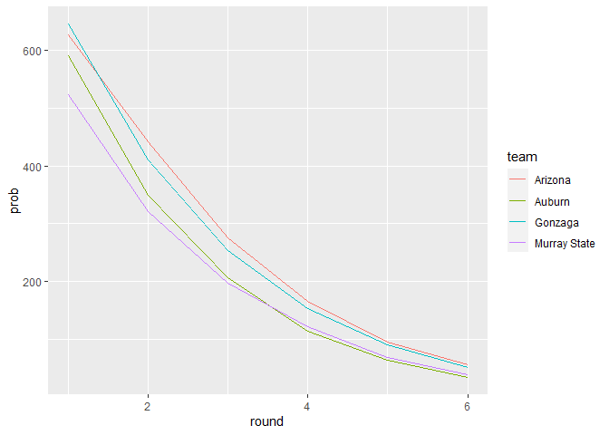
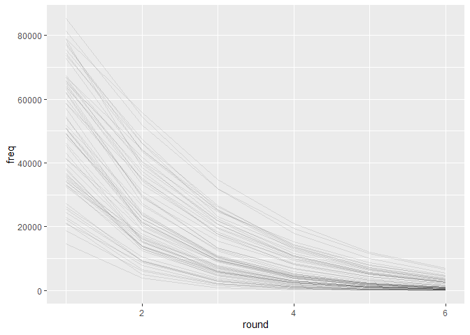

NCAA Simulation
================
Andrew Couch
3/6/2022

# 2022 NCAA March Madness Simulation

Written in R and Developed by [Andrew
Couch](https://www.linkedin.com/in/andrew-couch/)

## Description

A short simulation was created for an entry to my works’ march madness
bracket. The simulation uses ELO scores that were created from the most
recent basketball season. I decided to simulate the march madness
bracket since I do not know anything about college sports and
basketball. The simulation uses a Monte Carlo simulation with the ELO
scores that update throughout the bracket.

## Code for the simulation

``` r
library(tidyverse)
```

    ## -- Attaching packages ----------------------------------------------------------------------------------------------------------- tidyverse 1.3.1 --

    ## v ggplot2 3.3.5     v purrr   0.3.4
    ## v tibble  3.1.6     v dplyr   1.0.8
    ## v tidyr   1.2.0     v stringr 1.4.0
    ## v readr   2.1.2     v forcats 0.5.1

    ## -- Conflicts -------------------------------------------------------------------------------------------------------------- tidyverse_conflicts() --
    ## x dplyr::filter() masks stats::filter()
    ## x dplyr::lag()    masks stats::lag()

``` r
library(progress)
library(elo)
set.seed(9)

# Read in NCAA basketball season history 
df <- tibble(files = list.files(path = "Data")) %>% 
  mutate(files = paste0("Data/", files),
         data = map(files, read_csv, show_col_types = FALSE)) %>% 
  unnest(data)

# Read in adjusted elos
elo_adjust <- read_csv("team_adjustment.csv")
```

    ## Rows: 759 Columns: 2

    ## -- Column specification ----------------------------------------------------------------------------------------------------------------------------
    ## Delimiter: ","
    ## chr (1): team
    ## dbl (1): value
    ## 
    ## i Use `spec()` to retrieve the full column specification for this data.
    ## i Specify the column types or set `show_col_types = FALSE` to quiet this message.

``` r
# Clean team names 
df <- df %>% 
  select(date, game_id, files, opponent, team_score, opp_score) %>% 
  distinct() %>% 
  mutate(files = str_replace(files, "_schedule.csv", ""),
         files = str_replace(files, "Data\\/", "")) %>% 
  distinct() %>% 
  rename(team = files, opp = opponent) %>% 
  mutate(across(c(team, opp), 
                .fns = ~str_replace_all(.x, "_|-", " ") %>% 
                  str_replace("St ", "State ")),
         across(c(team, opp),
                .fns = ~case_when(
           .x == "State Peter's" ~ "Saint Peter's",
           .x == "Abil Christian" ~ "Abilene Christian",
           .x == "G Washington" ~ "George Washington",
           .x == "San José State" ~ "San Jose State",
           .x == "Jacksonville St" ~ "Jacksonville State",
           str_starts(.x, "State ") ~ str_replace(.x, "State ", "Saint "),
           T ~ .x
         ))) 
```

``` r
# Randomly sample from each game (pairwise head-to-head ex. A vs. B and B vs. A)
match_df <- df %>% 
  group_by(game_id) %>% 
  slice_sample(n = 1) %>% 
  ungroup() %>% 
  arrange(date)
```

``` r
# Define function for optimizing elo scores using AUC
tune_elo <- function(x){
  
  mu <- 1500    
  sd_var <-  54.06961   
  
  elo.run(score(team_score, opp_score) ~ team + opp, 
          data = match_df, 
          k = 20,
          initial.elos = set_names((x * sd_var) + mu , teams)) %>% 
    summary() %>% 
    pluck("auc", 1) * -1 
}

# Optimize elo scores 
res <- optim(rep(0, 759), tune_elo, method = "L-BFGS-B", lower = -2, upper = 2, control = list(maxit = 1e5))

# View adjusted elo scores 
elo.run(score(team_score, opp_score) ~ team + opp, 
        data = match_df, 
        k = 20,
        initial.elos = set_names((res$par* 54.06961) + 1500, teams)) %>% 
  final.elos() %>% 
  as_tibble(rownames = "team") %>% 
  rename(adjusted = value) %>% 
  left_join(
    elo.run(score(team_score, opp_score) ~ team + opp, 
            data = match_df, 
            k = 20) %>% 
      final.elos() %>% 
      as_tibble(rownames = "team") %>% 
      rename(original = value),
    by = "team"
  ) %>% 
  ggplot(aes(x = original, y = adjusted)) + 
  geom_abline() + 
  geom_point() + 
  tune::coord_obs_pred()

# Save elo scores
elo.run(score(team_score, opp_score) ~ team + opp, 
        data = match_df, 
        k = 20,
        initial.elos = set_names((res$par* 54.06961) + 1500, teams)) %>% 
  final.elos() %>% 
  as_tibble(rownames = "team") %>% 
  write_csv("team_adjustment.csv")
```

``` r
# Compute ending elo for the season to use in simulation 
# Uses initial elos from ELO_Adjustment.rmd that optimizes ELO scores using AUC
start_elo <- elo.run(score(team_score, opp_score) ~ team + opp, 
                     data = match_df, 
                     k = 20,
                     initial.elos = set_names(elo_adjust %>% pull(value), elo_adjust %>% pull(team))) %>% 
  final.elos() %>% 
  as_tibble(rownames = "team") %>% 
  rename(elo = value)
```

``` r
match_df %>% 
  select(team, opp) %>% 
  pivot_longer(everything()) %>% 
  select(value) %>% 
  distinct() %>% 
  arrange(value) %>% 
  filter(str_detect(value, "Jackson"))
```

    ## # A tibble: 3 x 1
    ##   value             
    ##   <chr>             
    ## 1 Jackson State     
    ## 2 Jacksonville      
    ## 3 Jacksonville State

``` r
# Create dataframes for each division for teams in March Madness bracket
# Bracket used: https://www.espn.com/espn/feature/story/_/page/bracketology/ncaa-bracketology-projecting-2022-march-madness-men-field
# Some teams are still playing for bracket and max elo is used to choose teams (will change or not)
west_df <- tibble(div = "west",
                  team = c("Gonzaga", "Georgia State",
                           "Boise State", "Memphis",
                           "UConn", "New Mexico State",
                           "Arkansas", "Vermont",
                           "Alabama", "Rutgers",
                           "Texas Tech", "Montana State",
                           "Michigan State", "Davidson",
                           "Duke", "CSU Fullerton"))

east_df <- tibble(div = "east",
                  team = c("Baylor", "Norfolk State",
                           "North Carolina", "Marquette",
                           "Saint Mary's", "Indiana",
                           "UCLA", "Akron",
                           "Texas", "Virginia Tech",
                           "Purdue", "Yale",
                           "Murray State", "San Francisco",
                           "Kentucky", "Saint Peter's"))

south_df <- tibble(div = "south",
                   team = c("Arizona", "Bryant", 
                           "Seton Hall", "TCU",
                           "UAB", "Houston",
                           "Illinois", "Chattanooga", 
                           "Colorado State", "Michigan", 
                           "Tennessee", "Longwood", 
                           "Ohio State", "Loyola Chicago",
                           "Villanova", "Delaware"))

midwest_df <- tibble(div = "mdiwest",
                     team = c( "Kansas", "Texas Southern",
                               "San Diego State", "Creighton",
                               "Iowa", "Richmond",
                               "Providence", "South Dakota State",
                               "LSU", "Iowa State",
                               "Wisconsin", "Colgate",
                               "USC", "Miami",
                               "Auburn", "Jacksonville State"))
```

``` r
# Define a function for simulating a tournament 
simulate_tournament <- function(trials){
  # Create a helper function to simulate each division winners 
  simulate_div <- function(df){
    # Simulate round 1 
    round1 <- df %>% 
      # Join starting elo 
      inner_join(start_elo, by = "team") %>% 
      # Start First round 
      mutate(round = rep(c(1, 0), 8),
             round = cumsum(round),
             team_type = rep(c("team", "opp"), 8)) %>% 
      # Create head to head 
      pivot_wider(names_from = team_type, values_from = c(team, elo)) %>% 
      # Compute elo probability 
      mutate(team_prob = 1 / (1 +  10^((elo_opp - elo_team)/ 400)),
             # Simulate outcome
             outcome = runif(n = n()),
             outcome = if_else(outcome <= team_prob, 1, 0),
             # Compute elo change 
             elo_team = elo_team + 20*(outcome - team_prob), 
             elo_opp = elo_opp - 20*(outcome - team_prob),
             # Find the winning team and new elo
             team = if_else(outcome == 1, team_team, team_opp),
             elo = if_else(outcome == 1, 
                           elo_team + 20*(outcome - team_prob), 
                           elo_opp - 20*(outcome - team_prob)))
    
    # Simulate round 2 
    round2 <- round1 %>% 
      select(div, round, team, elo) %>% 
      # Start second round 
      mutate(round = rep(c(1, 0), 4),
             round = cumsum(round),
             team_type = rep(c("team", "opp"), 4)) %>% 
      pivot_wider(names_from = team_type, values_from = c(team, elo)) %>% 
      mutate(team_prob = 1 / (1 +  10^((elo_opp - elo_team)/ 400)),
             outcome = runif(n = n()),
             outcome = if_else(outcome <= team_prob, 1, 0),
             elo_team = elo_team + 20*(outcome - team_prob), 
             elo_opp = elo_opp - 20*(outcome - team_prob),
             team = if_else(outcome == 1, team_team, team_opp),
             elo = if_else(outcome == 1, 
                           elo_team + 20*(outcome - team_prob), 
                           elo_opp - 20*(outcome - team_prob)))
    
    # Simulate round three 
    round3 <- round2 %>% 
      select(div, round, team, elo) %>% 
      mutate(round = rep(c(1, 0), 2),
             round = cumsum(round),
             team_type = rep(c("team", "opp"), 2)) %>% 
      pivot_wider(names_from = team_type, values_from = c(team, elo)) %>% 
      mutate(team_prob = 1 / (1 +  10^((elo_opp - elo_team)/ 400)),
             outcome = runif(n = n()),
             outcome = if_else(outcome <= team_prob, 1, 0),
             elo_team = elo_team + 20*(outcome - team_prob), 
             elo_opp = elo_opp - 20*(outcome - team_prob), 
             team = if_else(outcome == 1, team_team, team_opp),
             elo = if_else(outcome == 1, 
                           elo_team + 20*(outcome - team_prob), 
                           elo_opp - 20*(outcome - team_prob))) 
    # Simulate round four 
    round4 <- round3 %>% 
      select(div, round, team, elo) %>% 
      mutate(round = rep(c(1, 0), 1),
             round = cumsum(round),
             team_type = rep(c("team", "opp"), 1)) %>% 
      pivot_wider(names_from = team_type, values_from = c(team, elo)) %>% 
      mutate(team_prob = 1 / (1 +  10^((elo_opp - elo_team)/ 400)),
             outcome = runif(n = n()),
             outcome = if_else(outcome <= team_prob, 1, 0),
             elo_team =elo_team + 20*(outcome - team_prob), 
             elo_opp = elo_opp - 20*(outcome - team_prob),
             team = if_else(outcome == 1, team_team, team_opp),
             elo = if_else(outcome == 1, 
                           elo_team + 20*(outcome - team_prob), 
                           elo_opp - 20*(outcome - team_prob)))
    
    # Combine each round's results 
    div_hist_df <- bind_rows(
      round1 %>% 
        select(team = team_team, elo_team, opp = team_opp, elo_opp, outcome) %>% 
        mutate(round = 1),
      round2 %>% 
        select(team = team_team, elo_team, opp = team_opp, elo_opp, outcome) %>% 
        mutate(round = 2),
      round3 %>% 
        select(team = team_team, elo_team, opp = team_opp, elo_opp, outcome) %>% 
        mutate(round = 3),
      round4 %>% 
        select(team = team_team, elo_team, opp = team_opp, elo_opp, outcome) %>% 
        mutate(round = 4)
    )
    
    # Combine simulated history of division with the winner of the division 
    nest(round4 %>% select(team, elo), data = everything()) %>% rename(winner = data) %>% 
      bind_cols(nest(div_hist_df, data = everything())) %>% rename(history = data)
  }
  
  
  pb$tick()
  Sys.sleep(1/100)
  
  # Simulate each divisions results and winner
  df <- tibble(data = list(west_df, east_df, midwest_df, south_df)) %>% 
    mutate(res = map(data, simulate_div)) %>% 
    select(res) %>% 
    unnest(cols = c(res)) 
  
  # Simulate the semi finals 
  # could use helper function for more tidier version but would need to create functions to aggregate results of winners 
  # resulting in a lot of nested data frames and slowness in simulations (planning on simulating 10,000 times)
  semi_final <- df %>% 
    select(winner) %>% 
    unnest(cols = c(winner)) %>% 
    mutate(round = rep(c(1, 0), 2),
           round = cumsum(round),
           team_type = rep(c("team", "opp"), 2)) %>% 
    pivot_wider(names_from = team_type, values_from = c(team, elo)) %>% 
    mutate(team_prob = 1 / (1 +  10^((elo_opp - elo_team)/ 400)),
           outcome = runif(n = n()),
           elo_team = elo_team + 20*(outcome - team_prob), 
           elo_opp = elo_opp - 20*(outcome - team_prob),
           outcome = if_else(outcome <= team_prob, 1, 0),
           team = if_else(outcome == 1, team_team, team_opp),
           elo = if_else(outcome == 1, 
                         elo_team + 20*(outcome - team_prob), 
                         elo_opp - 20*(outcome - team_prob))) 
  
  # Create holder for semi final history 
  hist <- semi_final %>%   
    select(team = team_team, elo_team, opp = team_opp, elo_opp, outcome) %>% 
    mutate(round = 5) %>% 
    nest(data = everything()) %>% 
    rename(history = data)
  
  # Create holder for semi final winners 
  winner <- semi_final %>% 
    select(team, elo) %>% 
    nest(data = everything()) %>% 
    rename(winner = data)
  
  # Append simulation history and winner division history and winners 
  df <- bind_rows(df, bind_cols(hist, winner))
  
  # Simulate the finals 
  final <- winner %>% 
    unnest(cols = c(winner)) %>% 
    mutate(round = rep(c(1, 0), 1),
           round = cumsum(round),
           team_type = rep(c("team", "opp"), 1)) %>% 
    pivot_wider(names_from = team_type, values_from = c(team, elo)) %>% 
    mutate(team_prob = 1 / (1 +  10^((elo_opp - elo_team)/ 400)),
           outcome = runif(n = n()),
           outcome = if_else(outcome <= team_prob, 1, 0),
           elo_team = elo_team + 20*(outcome - team_prob), 
           elo_opp = elo_opp - 20*(outcome - team_prob),
           team = if_else(outcome == 1, team_team, team_opp),
           elo = if_else(outcome == 1, 
                         elo_team + 20*(outcome - team_prob), 
                         elo_opp - 20*(outcome - team_prob)))
  
  # Create holder for final history
  hist <- final %>%   
    select(team = team_team, elo_team, opp = team_opp, elo_opp, outcome) %>% 
    mutate(round = 6) %>% 
    nest(data = everything()) %>% 
    rename(history = data)
  
  # Create holder for final winners 
  winner <- final %>% 
    select(team, elo) %>% 
    nest(data = everything()) %>% 
    rename(winner = data) 
  
  # Append simulation history and winner to division and semi final history and winners 
  df <- bind_rows(df, bind_cols(hist, winner))
  
  # Convert/Aggregate the nested dataframes to two nested data frames (history and winners)
  # May have a function that would make it easier
  bind_cols(
    df %>%
      select(history) %>%
      unnest(cols = c(history)) %>%
      nest(data = everything()) %>%
      rename(history = data),
    df %>%
      select(winner) %>%
      unnest(cols = c(winner)) %>%
      nest(data = everything()) %>%
      rename(winner = data)
  )
}

pb <- progress_bar$new(total = 1e5, format = "[:bar] :current/:total (:percent)")

start <- Sys.time()
res <- tibble(trials = seq.int(1, 1e5)) %>% mutate(sim = map(trials, simulate_tournament))
end <- Sys.time()
# Save simulation (won't be able to upload to github but may upload history as a csv)
write_rds(res, file = "ncaa_sim.RDS")
```

``` r
# Read in simulation 
res <- read_rds("ncaa_sim.RDS")

res_df <- res %>% 
  unnest(sim) %>% 
  select(trials, history) %>% 
  unnest(history) 
```

``` r
# Get top 10 teams who win the simulated finals 
bind_rows(
  res_df %>% 
    select(trials, round, team, outcome),
  res_df %>% 
    select(trials, round, team = opp, outcome) %>% 
    mutate(outcome = if_else(outcome == 1, 0, 1))
) %>% 
  filter(outcome == 1 & round == 6) %>% 
  group_by(team) %>% 
  summarise(total = sum(outcome)) %>% 
  ungroup() %>% 
  slice_max(total, n = 10) %>% 
  select(team, total) %>% 
  arrange(desc(total))
```

    ## # A tibble: 10 x 2
    ##    team         total
    ##    <chr>        <dbl>
    ##  1 Arizona       6965
    ##  2 Gonzaga       6501
    ##  3 Kansas        5485
    ##  4 Murray State  4769
    ##  5 Providence    4395
    ##  6 Auburn        4361
    ##  7 Wisconsin     3768
    ##  8 Baylor        3577
    ##  9 Duke          3484
    ## 10 Purdue        3426

``` r
# View round probabilities for top 5 teams who make it to the final round
bind_rows(
  res_df %>% 
    select(trials, round, team, outcome),
  res_df %>% 
    select(trials, round, team = opp, outcome) %>% 
    mutate(outcome = if_else(outcome == 1, 0, 1))
) %>% 
  add_count(trials) %>% 
  group_by(team, round, n) %>% 
  summarise(total = sum(outcome)) %>% 
  ungroup() %>% 
  mutate(prob = total / n) %>% 
  select(team, round, prob) %>% 
  filter(team %in% c("Murray State", "Gonzaga", "Arizona", "Auburn", "North Texas")) %>% 
  ggplot(aes(x = round, y = prob, color = team)) + 
  geom_line()
```

    ## `summarise()` has grouped output by 'team', 'round'. You can override using the `.groups` argument.

<!-- -->

``` r
# View every team's round probabilities 
bind_rows(
  res_df %>% 
    select(trials, round, team, outcome),
  res_df %>% 
    select(trials, round, team = opp, outcome) %>% 
    mutate(outcome = if_else(outcome == 1, 0, 1))
) %>% 
  group_by(round, team) %>% 
  summarise(freq = sum(outcome)) %>% 
  ungroup() %>% 
  ggplot(aes(x = round, y = freq, group = team)) + 
  geom_line(alpha = 0.1)
```

    ## `summarise()` has grouped output by 'round'. You can override using the `.groups` argument.

<!-- -->

``` r
# View most likely teams to make it for each round
bind_rows(
  res_df %>% 
    select(trials, round, team, outcome),
  res_df %>% 
    select(trials, round, team = opp, outcome) %>% 
    mutate(outcome = if_else(outcome == 1, 0, 1))
) %>% 
  group_by(round, team) %>% 
  summarise(wins = sum(outcome)) %>% 
  group_by(round) %>% 
  mutate(rank = dense_rank(desc(wins))) %>% 
  ungroup() %>% 
  filter(rank <= 2^(6 - round)) %>% 
  arrange(round, rank)
```

    ## `summarise()` has grouped output by 'round'. You can override using the `.groups` argument.

    ## # A tibble: 63 x 4
    ##    round team       wins  rank
    ##    <dbl> <chr>     <dbl> <int>
    ##  1     1 Kansas    85308     1
    ##  2     1 Gonzaga   81351     2
    ##  3     1 Arizona   79077     3
    ##  4     1 Kentucky  78857     4
    ##  5     1 Duke      77774     5
    ##  6     1 Purdue    77116     6
    ##  7     1 Wisconsin 75459     7
    ##  8     1 Auburn    74485     8
    ##  9     1 Baylor    73813     9
    ## 10     1 Villanova 72791    10
    ## # ... with 53 more rows

``` r
# Compute head to head probabilities from simulation
res_df %>% 
  mutate(opp_outcome = if_else(outcome == 1, 0, 1),
         team_a = if_else(team > opp, team, opp),
         team_b = if_else(team > opp, opp, team),
         outcome_a = if_else(team > opp, outcome, opp_outcome)) %>% 
  select(trials, round, team_a, team_b, outcome_a) %>% 
  count(round, team_a, team_b, outcome_a) %>% 
  mutate(outcome_a = if_else(outcome_a == 1, "win", "loss")) %>% 
  pivot_wider(names_from = outcome_a, values_from = n, values_fill = 0) %>% 
  mutate(win_prob = win / (win + loss)) 
```

    ## # A tibble: 1,991 x 6
    ##    round team_a             team_b          loss   win win_prob
    ##    <dbl> <chr>              <chr>          <int> <int>    <dbl>
    ##  1     1 Bryant             Arizona        79077 20923    0.209
    ##  2     1 Duke               CSU Fullerton  22226 77774    0.778
    ##  3     1 Gonzaga            Georgia State  18649 81351    0.814
    ##  4     1 Illinois           Chattanooga    49093 50907    0.509
    ##  5     1 Jacksonville State Auburn         74485 25515    0.255
    ##  6     1 LSU                Iowa State     53965 46035    0.460
    ##  7     1 Memphis            Boise State    63174 36826    0.368
    ##  8     1 Michigan           Colorado State 65670 34330    0.343
    ##  9     1 Michigan State     Davidson       58667 41333    0.413
    ## 10     1 Norfolk State      Baylor         73813 26187    0.262
    ## # ... with 1,981 more rows

``` r
# Read in sim
df <- read_rds("ncaa_sim.RDS")

df <- df %>% 
  unnest(sim) %>% 
  select(trials, history) %>% 
  unnest(history)

# Compute head to head matchups
bracket_df <- df %>% 
  select(trials, round, team, opp, team_outcome = outcome) %>% 
  mutate(team_a = if_else(team > opp, team, opp),
         team_b = if_else(team > opp, opp, team),
         opp_outcome = if_else(team_outcome == 1, 0, 1),
         outcome = if_else(team > opp, team_outcome, opp_outcome)) %>% 
  select(trials, round, team_a, team_b, outcome) %>% 
  group_by(team_a, team_b) %>% 
  summarise(avg = mean(outcome)) %>% 
  ungroup() %>% 
  mutate(outcome = if_else(avg >= 0.5, 1, 0)) %>% 
  select(team_a, team_b, outcome)
```

    ## `summarise()` has grouped output by 'team_a'. You can override using the `.groups` argument.

``` r
# Create bracket
west_df <- tibble(div = "west",
                  team = c("Gonzaga", "Georgia State",
                           "Boise State", "Memphis",
                           "UConn", "New Mexico State",
                           "Arkansas", "Vermont",
                           "Alabama", "Rutgers",
                           "Texas Tech", "Montana State",
                           "Michigan State", "Davidson",
                           "Duke", "CSU Fullerton"))

east_df <- tibble(div = "east",
                  team = c("Baylor", "Norfolk State",
                           "North Carolina", "Marquette",
                           "Saint Mary's", "Indiana",
                           "UCLA", "Akron",
                           "Texas", "Virginia Tech",
                           "Purdue", "Yale",
                           "Murray State", "San Francisco",
                           "Kentucky", "Saint Peter's"))

south_df <- tibble(div = "south",
                   team = c("Arizona", "Bryant", 
                            "Seton Hall", "TCU",
                            "UAB", "Houston",
                            "Illinois", "Chattanooga", 
                            "Colorado State", "Michigan", 
                            "Tennessee", "Longwood", 
                            "Ohio State", "Loyola Chicago",
                            "Villanova", "Delaware"))

midwest_df <- tibble(div = "mdiwest",
                     team = c( "Kansas", "Texas Southern",
                               "San Diego State", "Creighton",
                               "Iowa", "Richmond",
                               "Providence", "South Dakota State",
                               "LSU", "Iowa State",
                               "Wisconsin", "Colgate",
                               "USC", "Miami",
                               "Auburn", "Jacksonville State"))

# Use simulation to get expected outcomes of each round
bind_rows(west_df, east_df, midwest_df, south_df) %>% 
  mutate(game = rep(c(1, 0), n() / 2),
         game = cumsum(game),
         round = 1) %>% 
  arrange(game, team) %>% 
  mutate(type = rep(c("team_1", "team_2"), n() / 2)) %>% 
  pivot_wider(names_from = type, values_from = team) %>% 
  mutate(team_a = if_else(`team_1` > `team_2`, `team_1`, `team_2`),
         team_b = if_else(`team_1` > `team_2`, `team_2`, `team_1`)) %>% 
  select(div, round, game, team_a, team_b) %>% 
  left_join(bracket_df, by = c("team_a", "team_b")) %>% 
  mutate(team = if_else(outcome == 1, team_a, team_b)) %>% 
  select(team) %>% 
  print() %>%
  mutate(game = rep(c(1, 0), n() / 2),
         game = cumsum(game),
         type = rep(c("team_1", "team_2"), n() / 2)) %>% 
  pivot_wider(names_from = type, values_from = team) %>% 
  mutate(team_a = if_else(`team_1` > `team_2`, `team_1`, `team_2`),
         team_b = if_else(`team_1` > `team_2`, `team_2`, `team_1`)) %>% 
  select(game, team_a, team_b) %>% 
  left_join(bracket_df, by = c("team_a", "team_b")) %>% 
  mutate(team = if_else(outcome == 1, team_a, team_b)) %>% 
  select(team) %>% 
  print() %>%
  mutate(game = rep(c(1, 0), n() / 2),
         game = cumsum(game),
         type = rep(c("team_1", "team_2"), n() / 2)) %>% 
  pivot_wider(names_from = type, values_from = team) %>% 
  mutate(team_a = if_else(`team_1` > `team_2`, `team_1`, `team_2`),
         team_b = if_else(`team_1` > `team_2`, `team_2`, `team_1`)) %>% 
  select(game, team_a, team_b) %>% 
  left_join(bracket_df, by = c("team_a", "team_b")) %>% 
  mutate(team = if_else(outcome == 1, team_a, team_b)) %>% 
  select(team) %>% 
  print() %>%
  mutate(game = rep(c(1, 0), n() / 2),
         game = cumsum(game),
         type = rep(c("team_1", "team_2"), n() / 2)) %>% 
  pivot_wider(names_from = type, values_from = team) %>% 
  mutate(team_a = if_else(`team_1` > `team_2`, `team_1`, `team_2`),
         team_b = if_else(`team_1` > `team_2`, `team_2`, `team_1`)) %>% 
  select(game, team_a, team_b) %>% 
  left_join(bracket_df, by = c("team_a", "team_b")) %>% 
  mutate(team = if_else(outcome == 1, team_a, team_b)) %>% 
  select(team) %>% 
  print() %>%
  mutate(game = rep(c(1, 0), n() / 2),
         game = cumsum(game),
         type = rep(c("team_1", "team_2"), n() / 2)) %>% 
  pivot_wider(names_from = type, values_from = team) %>% 
  mutate(team_a = if_else(`team_1` > `team_2`, `team_1`, `team_2`),
         team_b = if_else(`team_1` > `team_2`, `team_2`, `team_1`)) %>% 
  select(game, team_a, team_b) %>% 
  left_join(bracket_df, by = c("team_a", "team_b")) %>% 
  mutate(team = if_else(outcome == 1, team_a, team_b)) %>% 
  select(team) %>% 
  print() %>%
  mutate(game = rep(c(1, 0), n() / 2),
         game = cumsum(game),
         type = rep(c("team_1", "team_2"), n() / 2)) %>% 
  pivot_wider(names_from = type, values_from = team) %>% 
  mutate(team_a = if_else(`team_1` > `team_2`, `team_1`, `team_2`),
         team_b = if_else(`team_1` > `team_2`, `team_2`, `team_1`)) %>% 
  select(game, team_a, team_b) %>% 
  left_join(bracket_df, by = c("team_a", "team_b")) %>% 
  mutate(team = if_else(outcome == 1, team_a, team_b)) %>% 
  select(team)
```

    ## # A tibble: 32 x 1
    ##    team          
    ##    <chr>         
    ##  1 Gonzaga       
    ##  2 Boise State   
    ##  3 UConn         
    ##  4 Arkansas      
    ##  5 Alabama       
    ##  6 Texas Tech    
    ##  7 Davidson      
    ##  8 Duke          
    ##  9 Baylor        
    ## 10 North Carolina
    ## # ... with 22 more rows
    ## # A tibble: 16 x 1
    ##    team          
    ##    <chr>         
    ##  1 Gonzaga       
    ##  2 Arkansas      
    ##  3 Texas Tech    
    ##  4 Duke          
    ##  5 Baylor        
    ##  6 Saint Mary's  
    ##  7 Purdue        
    ##  8 Murray State  
    ##  9 Kansas        
    ## 10 Providence    
    ## 11 Wisconsin     
    ## 12 Auburn        
    ## 13 Arizona       
    ## 14 Houston       
    ## 15 Colorado State
    ## 16 Villanova     
    ## # A tibble: 8 x 1
    ##   team          
    ##   <chr>         
    ## 1 Gonzaga       
    ## 2 Duke          
    ## 3 Baylor        
    ## 4 Murray State  
    ## 5 Kansas        
    ## 6 Auburn        
    ## 7 Arizona       
    ## 8 Colorado State
    ## # A tibble: 4 x 1
    ##   team        
    ##   <chr>       
    ## 1 Gonzaga     
    ## 2 Murray State
    ## 3 Kansas      
    ## 4 Arizona     
    ## # A tibble: 2 x 1
    ##   team   
    ##   <chr>  
    ## 1 Gonzaga
    ## 2 Arizona

    ## # A tibble: 1 x 1
    ##   team   
    ##   <chr>  
    ## 1 Gonzaga

``` r
# Read in past season scores for tie-breaker
scores <-  tibble(files = list.files(path = "Data")) %>% 
  mutate(files = paste0("Data/", files),
         data = map(files, read_csv, show_col_types = FALSE)) %>% 
  unnest(data) %>% 
  select(date, game_id, files, opponent, team_score, opp_score) %>% 
  distinct() %>% 
  mutate(files = str_replace(files, "_schedule.csv", ""),
         files = str_replace(files, "Data\\/", "")) %>% 
  distinct() %>% 
  rename(team = files, opp = opponent) %>% 
  mutate(across(c(team, opp), 
                .fns = ~str_replace_all(.x, "_|-", " ") %>% 
                  str_replace("St ", "State ")),
         across(c(team, opp),
                .fns = ~case_when(
                  .x == "State Peter's" ~ "Saint Peter's",
                  .x == "Abil Christian" ~ "Abilene Christian",
                  .x == "G Washington" ~ "George Washington",
                  .x == "San José State" ~ "San Jose State",
                  .x == "Jacksonville St" ~ "Jacksonville State",
                  str_starts(.x, "State ") ~ str_replace(.x, "State ", "Saint "),
                  T ~ .x
                ))) 

# Compute median points scored for finalists
bind_rows(
  scores %>% 
    filter(team == "Gonzaga" | team == "Arizona") %>% 
    select(team, team_score),
  scores %>% 
    filter(opp == "Gonzaga" | opp == "Arizona") %>% 
    select(opp, opp_score) %>% 
    rename(team = opp, team_score = opp_score)
) %>% 
  group_by(team) %>% 
  summarise(median = median(team_score, na.rm = TRUE))
```

    ## # A tibble: 2 x 2
    ##   team    median
    ##   <chr>    <dbl>
    ## 1 Arizona     84
    ## 2 Gonzaga     89
